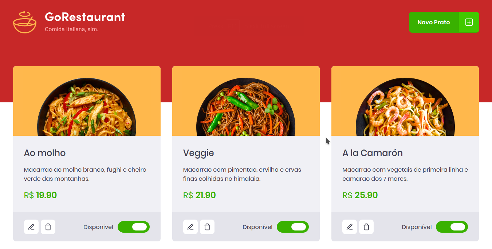

<h1 align="center">
  
</h1>

<p align="center">
  <a href="#information_source-how-to-use">ℹ️ How To Use</a>&nbsp;&nbsp;&nbsp;|&nbsp;&nbsp;&nbsp;
  <a href="#rocket-technologies">🚀 Technologies</a>&nbsp;&nbsp;&nbsp;|&nbsp;&nbsp;&nbsp;
</p>

<p align="center">
  GoRestaurant is a project developed in React JS and TypeScript as a challenge in Rocketseat's GoStack 11 Bootcamp.
</p>

---



# :information_source: How To Use

Clone the repository

```bash
https://github.com/lhcbernardes/Go-restaurante.git
```

```bash
# Install the dependencies
yarn
# or
npm install

# Start the JSON Server
json-server server.json -p 3333

# Run GoRestaurant Web
yarn start
# or
npm start
```

# :rocket: Technologies

- [ReactJS](https://pt-br.reactjs.org/)
- [TypeScript](https://www.typescriptlang.org/)
- [axios](https://github.com/axios/axios)
- [react-icons](https://react-icons.github.io/react-icons/)
- [react-modal](https://github.com/reactjs/react-modal)
- [react-router-dom](https://reacttraining.com/react-router/web)
- [Styled Components](https://www.styled-components.com/)
- [yup](https://github.com/jquense/yup)
- [ESLint](https://eslint.org/)
- [Prettier](https://prettier.io/)
- [JSON Server](https://github.com/typicode/json-server)


